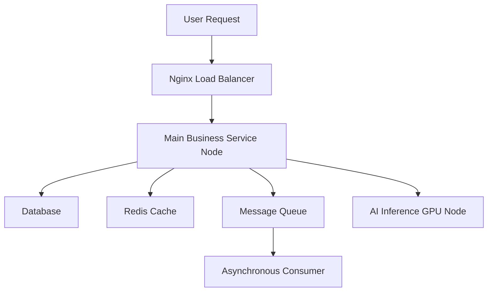

# mcp-system-infra

 

# 🚀 Intelligent Architecture Recommendation Engine: Tailored for Your System

In today's rapidly evolving digital landscape, how can you quickly and efficiently build a scalable and reliable technical infrastructure? The **Intelligent Architecture Recommendation Engine** is here to solve that challenge.

Based on key parameters—QPS (queries per second), concurrent users, daily active users, business type, database choice, and AI model size—this tool automatically generates:

- 💡 Optimal server resource allocation  
- 🧩 Required middleware module combinations  
- 🏗️ Recommended overall system architecture  
- ☁️ Suggested cloud providers and deployment strategies  
- 📊 One-click export of Markdown report + architecture diagram

---

## ✨ Key Benefits

### ✅ Fully Parameter-Driven, Business-Oriented

Simply provide the following parameters:
- `--qps`: Peak request throughput
- `--concurrentUsers`: Number of concurrent connections
- `--uad`: Daily Active Users (UAD)
- `--type`: Business type (`web` / `ai`)
- `--db`: Database type (`relational` / `nosql` / `analytics`)
- `--model`: AI model size (`small` / `medium` / `large`)

The system will automatically assess and recommend:
- CPU / Memory / Network configuration
- Redis cache capacity and eviction strategy
- Message queue type and concurrency handling
- Whether to adopt a microservices architecture
- Whether to enable distributed architecture and GPU inference clusters

---

## 🗺️ Architecture Recommendation Diagram

The system automatically generates a Mermaid diagram to clearly represent component relationships:

#
## 
▶️ Quick Start

### CLI
~~~bash
npx -y mcp-system-infra
~~~

### MCP Server Configuration

~~~json
{
    "mcpServers": {
        "mcp-system-infra": {
            "command": "npx",
            "args": [
                "-y",
                "mcp-system-infra"
            ]
        }
    }
}
~~~

## MCP Example:

Please help design a web-based system architecture report with the following specifications:

- QPS (Queries Per Second): 100  
- Concurrent Users: 50  
- Daily Active Users: 300  
- Database Type: Relational  
- Model Size: Medium  

---

## 
💭 Murmurs

This project is for educational and internal use only. Contributions and feedback are welcome.  
For feature customization, web deployment, or enterprise integration, please contact the project maintainer.

<h1>Contact</h1>

## Business Contact Email: [deeppathai@outlook.com](mailto:deeppathai@outlook.com)

---

## 🧠 MCP Access Addresses

- 🌐 [ModelScope MCP Address](https://modelscope.cn/mcp/servers/deeppathai/mcp-system-infra)  
  For testing and integrating `mcp-system-infra` directly within the ModelScope platform.

- 🛠️ [Smithery.ai MCP Address](https://smithery.ai/server/@deeppath-ai/mcp-system-infra)  
  For visual configuration and invocation of the `mcp-system-infra` service via Smithery.

