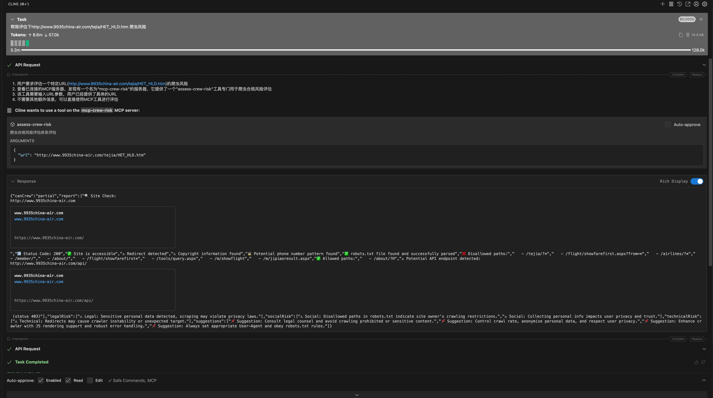
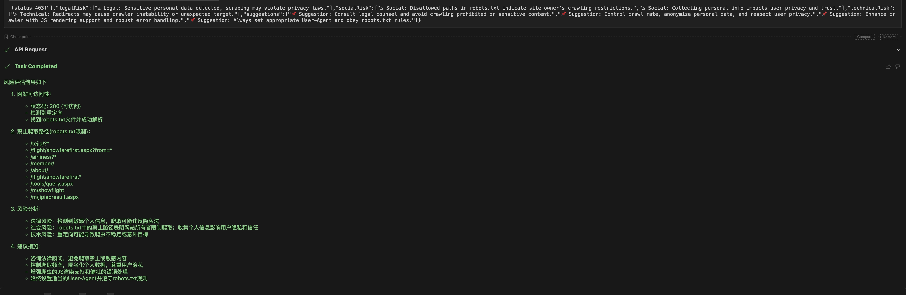

# mcp-system-infra

 

A Crawler Risk Assessor based on the Model Context Protocol (MCP).  
This server provides a simple API interface that allows users to perform a comprehensive crawler compliance risk assessment for a specified webpage.

# Crawler Compliance Risk Assessment Framework Description

This framework aims to provide crawler developers and operators with a comprehensive automated compliance detection toolset to evaluate the crawler-friendliness and potential risks of target websites. It covers three major dimensions: legal, social ethics, and technical aspects. Through multi-level risk warnings and specific recommendations, it helps plan crawler strategies reasonably to avoid legal disputes and negative social impacts while improving technical stability and efficiency.

---

## Framework Structure

### 1. Legal Risk

#### Detection Content
- Whether there are explicit Terms of Service restricting crawler activities
- Whether the website declares copyright information and whether content is copyright protected
- Whether pages contain sensitive personal data (e.g., emails, phone numbers, ID numbers)

#### Risk Significance
Violating terms may lead to breach of contract, infringement, or criminal liability; scraping sensitive data may violate privacy regulations such as GDPR, CCPA, etc.

#### Detection Examples
- Detect `<meta>` tags and key keywords in page content
- Regex matching for emails, phone numbers

---

### 2. Social/Ethical Risk

#### Detection Content
- Whether robots.txt disallows crawler access to specific paths
- Anti-crawling technologies deployed by the site (e.g., Cloudflare JS Challenge)
- Risks of collecting user privacy or sensitive information

#### Risk Significance
Excessive crawling may harm user experience and trust; collecting private data has ethical risks and social responsibility implications.

#### Detection Examples
- Accessing and parsing robots.txt
- Detecting anti-crawling mechanisms and JS challenges
- Sensitive information extraction warnings

---

### 3. Technical Risk

#### Detection Content
- Whether redirects, CAPTCHAs, JS rendering obstacles are encountered during access
- Whether robots.txt can be successfully accessed to get crawler rules
- Exposure of target API paths, possible permissions or rate limiting restrictions

#### Risk Significance
Technical risks may cause crawler failure, IP bans, or incomplete data, affecting business stability.

#### Detection Examples
- HTTP status code and response header analysis
- Anti-crawling technology detection
- API path scanning

---

## Rating System

- **allowed**: No obvious restrictions or risks, generally safe to crawl
- **partial**: Some restrictions (e.g., robots.txt disallows some paths, anti-crawling measures), requires cautious operation
- **blocked**: Severe restrictions or high risk (e.g., heavy JS anti-crawling challenges, sensitive data protection), crawling is not recommended

---

## Recommendations

| Risk Dimension       | Summary Recommendations                                                                 |
| -------------------- | --------------------------------------------------------------------------------------- |
| Legal Risk           | Carefully read and comply with the target site's Terms of Service; avoid scraping sensitive or personal data; consult legal counsel if necessary. |
| Social/Ethical Risk  | Control crawl frequency; avoid impacting server performance and user experience; be transparent about data sources and usage. |
| Technical Risk       | Use appropriate crawler frameworks and strategies; support dynamic rendering and anti-crawling bypass; handle exceptions and monitor access health in real-time. |

---

## Implementation Process

1. **Pre-crawl Assessment**  
   Run compliance assessment on the target site to confirm risk levels and restrictions.

2. **Compliance Strategy Formulation**  
   Adjust crawler access frequency and content scope according to assessment results to avoid breaches or violations.

3. **Crawler Execution and Monitoring**  
   Continuously monitor technical exceptions and risk changes during crawling; regularly reassess.

4. **Data Processing and Protection**  
   Ensure crawled data complies with privacy protection requirements and perform necessary anonymization.

---

## Technical Implementation Overview

- Use Axios + node-fetch for HTTP requests, supporting timeout and redirect control.
- Parse `robots.txt` and page `meta` tags to automatically identify crawler rules.
- Use regex to detect privacy-sensitive information (emails, phones, ID numbers, etc.).
- Detect anti-crawling tech (e.g., Cloudflare JS Challenge) and exposed API endpoints.
- Provide legal, social, and technical risk warnings and comprehensive suggestions via risk evaluation functions.

---

## Future Extensions

- Integrate Puppeteer/Playwright for JavaScript-rendered page detection.
- Automatically parse and notify on Terms of Service text updates.
- Add dedicated detection modules for GDPR, CCPA, and other regional laws.
- Combine machine learning models to improve privacy-sensitive data recognition accuracy.
- Provide Web UI to display compliance reports and risk suggestions.

---

## Summary

This compliance risk assessment framework provides a foundational and comprehensive risk evaluation for crawler development and operation. It helps teams comply with laws, regulations, and ethical principles while enhancing technical efficiency and data quality and reducing potential legal and social risks.

<h1>✅ 1. Technical Checks</h1>

| Check Item                         | Description                                                | Recommendation                                   |
| --------------------------------- | ---------------------------------------------------------- | ------------------------------------------------|
| `robots.txt` existence             | Access `https://example.com/robots.txt`                    | If exists, parse and strictly follow the rules  |
| Allowed crawling paths in robots.txt | Check rules for specified User-Agent (e.g., `Disallow`, `Allow`) | Set a proper `User-Agent` for matching            |
| Meta robots tag                   | Whether `<meta name="robots" content="noindex, nofollow">` exists on the page | If present, avoid crawling/indexing page content |
| X-Robots-Tag response header     | Whether HTTP response headers contain `X-Robots-Tag` (e.g., `noindex`) | Follow the respective directives                 |
| Dynamic rendered content          | Whether page depends on JS loading (React/Vue etc.)        | May require headless browser (e.g., Puppeteer)   |
| IP rate limiting / WAF            | Whether access frequency limits, IP blocks, CAPTCHAs exist | Implement rate limiting, retry, proxy pools       |
| Anti-crawling mechanism detection | Check for token validation, Referer checks, JS obfuscation | Use network analysis tools to investigate         |
| API support                      | Whether page data is also provided via public API          | Prefer API for higher efficiency if available    |

<h1>2. Legal and Ethical Checks</h1>

| Check Item                      | Description                           | Recommendation                   |
| ------------------------------ | ---------------------------------- | ------------------------------ |
| Existence of Terms of Service   | Check if ToS prohibits automated crawling | If explicitly prohibited, do not crawl |
| Website copyright declaration   | Whether content copyright is declared in footer | Avoid crawling copyrighted data for commercial use |
| Public data/open data policy    | Some sites offer open data or licenses | Comply with licenses or open-source agreements |
| Previous litigation due to crawling | Some sites (e.g., LinkedIn, Facebook) have strict anti-crawling stances | If prior cases exist, higher risk — avoid crawling |

<h1>3. Data Protection and Privacy</h1>

| Check Item                      | Description                          | Recommendation                   |
| ------------------------------ | --------------------------------- | ------------------------------ |
| Presence of user-generated content | Comments, avatars, phone, email, location, etc. | Scraping such data may violate privacy laws |
| Privacy Policy existence        | Check data usage boundaries and restrictions | Follow data processing terms stated in policy |
| Involvement of EU or CA users   | Subject to GDPR or CCPA regulations | Do not store or analyze personal data without consent |
| Scraped personally identifiable info | Phone numbers, IDs, emails, IP addresses | Filter or anonymize unless necessary          |
| Sensitive domain data           | Medical, financial, minors, etc.  | Requires strict compliance, recommend avoiding or anonymizing |

<h1>4. Practical Operational Suggestions (Compliance-Friendly Strategies)</h1>

| Check Item                   | Description                                         | Recommendation                                  |
| ----------------------------| --------------------------------------------------| -----------------------------------------------|
| Set reasonable `User-Agent`   | Clearly indicate tool origin, e.g., `MyCrawlerBot/1.0 (+email@example.com)` | Increase credibility and ease site identification |
| Set access frequency limits   | Avoid too frequent requests (e.g., 1-2 requests/sec) | Reduce server load, avoid being blocked         |
| Add `Referer` and `Accept` headers | Simulate normal browser behavior                    | Prevent anti-crawling blocking                   |
| Support failure retry mechanism | Handle 503, 429, connection drop errors            | Improve robustness                               |
| Logging and crawl timing control | Save crawl logs and schedule crawling during off-peak hours | Coordinate with site maintenance windows         |
| Indicate data source in outputs | When used for display or research, cite data source | Avoid copyright disputes                          |
| Data storage anonymization    | Especially for personal data                         | Avoid privacy law violations                      |

## 🧠 One-sentence summary:

No `robots.txt` ≠ permission to crawl freely; technical crawlability ≠ legal permission; respect data, websites, and users — that is the foundation of compliant crawling.

<h1 align="center">
🚩Features
</h1>

## MCP-Based Website Crawler Compliance Risk Assessment – Main Features:

---

## 1. Target Website Access and Basic Status Check ✅ Completed

- Access the target website homepage with timeout and up to 5 redirects supported
- Return HTTP status code to determine site accessibility
- Detect redirects and warn about potential risks

---

## 2. Anti-Crawling Mechanism Detection ✅ Completed

- Detect if server uses Cloudflare or similar anti-crawling protection
- Detect presence of JavaScript verification challenges (e.g., Cloudflare JS Challenge)
- Parse page `<meta name="robots">` tags and HTTP response header `X-Robots-Tag`
- Automatically request and parse `robots.txt`, extract allowed and disallowed paths

---

## 3. Sensitive Content Detection and Legal Risk Warning ✅ Completed

- Detect copyright notices and Terms of Service related information on pages
- Regex match to identify possible personal private information (email, phone, ID)
- Provide legal compliance warnings to prevent infringement and privacy leaks

---

## 4. Public API Endpoint Detection ✅ Completed

- Access common API paths (e.g., `/api/`, `/v1/`, `/rest/`)
- Determine whether APIs are open and whether authentication is required; warn about potential permission and rate limiting risks

---

## 5. Comprehensive Risk Evaluation and Classification ✅ Completed

- Provide three-level crawl permissibility rating based on all detection results:
  - `allowed`: no obvious restrictions or risks
  - `partial`: some technical or compliance restrictions
  - `blocked`: obvious anti-crawling or high risk

---

## 6. Planned Features 🚧 Pending

 
  
  

<h1 align="center">⚙️Installation</h1>

~~~bash
git clone https://github.com/Joooook/mcp-system-infra.git
npm i
~~~

## 
▶️Quick Start

### CLI
~~~bash
npx -y mcp-system-infra
~~~

### MCP Server Configuration

~~~json
{
    "mcpServers": {
        "mcp-system-infra": {
            "command": "npx",
            "args": [
                "-y",
                "mcp-system-infra"
            ]
        }
    }
}
~~~

## 
💭Murmurs

This project is for learning purposes only. Contributions and feature requests are welcome.

<h1>Contact</h1>

## Business Collaboration Email: [deeppathai@outlook.com](mailto:deeppathai@outlook.com)

## 🧠 MCP Access Links

- 🌐 [ModelScope MCP Address](https://modelscope.cn/mcp/servers/deeppathai/mcp-system-infra)  
  For testing and integrating the `mcp-system-infra` service on the ModelScope platform.

- 🛠️ [Smithery.ai MCP Address](https://smithery.ai/server/@deeppath-ai/mcp-system-infra)  
  For visually configuring and invoking the `mcp-system-infra` service via the Smithery platform.
