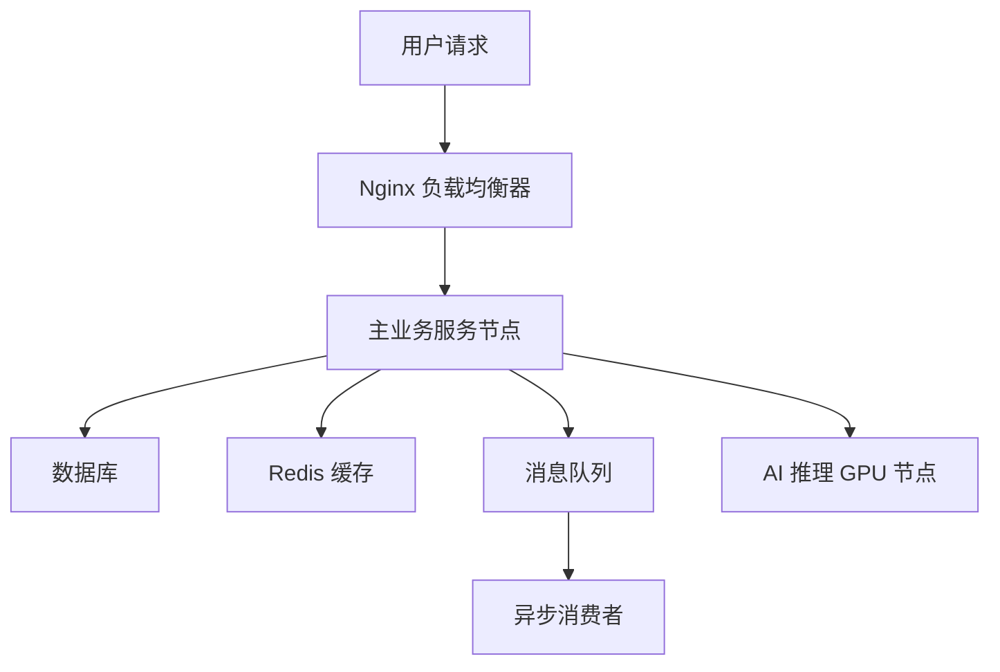

<div align="center">

# mcp-system-infra

</div> 

# 🚀 智能架构推荐引擎：为你的系统量身定制

在数字业务飞速发展的今天，如何快速、高效地构建一套可弹性伸缩、稳定可靠的技术架构？**智能架构推荐引擎**为你解决难题。

我们基于核心参数 —— QPS（每秒请求量）、并发用户数、日活跃用户量、业务类型、数据库选型和AI模型规模 —— 自动生成：

- 💡 最优服务器资源配置
- 🧩 所需中间件模块组合
- 🏗️ 推荐的整体系统架构
- ☁️ 推荐的云服务商与部署策略
- 📊 Markdown 报告 + 架构图一键导出

---

## ✨ 核心优势

### ✅ 全参数驱动，贴合业务实际

你只需输入以下参数：
- `--qps`：业务峰值吞吐
- `--concurrentUsers`：并发连接数
- `--uad`：日活跃用户数（UAD）
- `--type`：业务类型（web / ai）
- `--db`：数据库类型（relational / nosql / analytics）
- `--model`：AI 模型大小（small / medium / large）

系统将基于这些参数自动评估所需：
- CPU / 内存 / 网络配置
- Redis 缓存容量与淘汰策略
- 消息队列类型与并发处理能力
- 是否采用微服务架构
- 是否启用分布式架构与 GPU 推理集群

---

## 🗺️ 架构推荐示意图

系统自动输出 Mermaid 架构图，清晰表达组件关系：




## <div align="center">▶️Quick Start</div>

### CLI
~~~bash
npx -y mcp-system-infra
~~~

### MCP sever configuration

~~~json
{
    "mcpServers": {
        "mcp-system-infra": {
            "command": "npx",
            "args": [
                "-y",
                "mcp-system-infra"
            ]
        }
    }
}
~~~

## 使用示例

```
帮忙设计一个web类型的系统，qps=100，concurrentUsers=50，activeUsersDaily=300，dbType=relational，modelSize=medium的系统架构报告
```

## <div align="center">💭Murmurs</div>
本项目仅用于学习，欢迎催更。如需定制功能、部署为 Web 服务、与内部推广平台对接，请联系产品维护者。

<div align="center"><h1>联系方式</h1></div>
  
  
  ## 商务合作联系邮件：  [deeppathai@outlook.com](mailto:deeppathai@outlook.com)

</div>


## 🧠 MCP 接入地址

- 🌐 [魔搭 ModelScope MCP 地址](https://modelscope.cn/mcp/servers/deeppathai/mcp-system-infra)  
  适用于在 ModelScope 平台上调试和集成 `mcp-system-infra` 服务。

- 🛠️ [Smithery.ai MCP 地址](https://smithery.ai/server/@deeppath-ai/mcp-system-infra)  
  可用于在 Smithery 平台中以可视化方式配置和调用 `mcp-system-infra` 服务。

